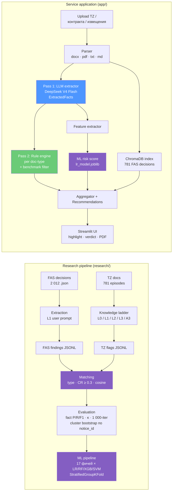

# ZakupkiCheck

> Автоматизированная проверка закупочной документации по 44-ФЗ с применением LLM

Репозиторий содержит два компонента:

1. **Research pipeline** (`research/`) — извлечение признаков соответствия из ТЗ
   и нарушений из решений ФАС, сопоставление, оценка качества.
2. **Сервисное приложение** (`app/`) — двухпроходный Streamlit-сервис: LLM
   извлекает структурированные факты, rule engine проверяет на соответствие
   44-ФЗ, ML-скоринг рисков, RAG-поиск прецедентов ФАС.

---

## Архитектура



Подробное описание архитектуры — `docs/architecture.md`.

---

## Основные результаты

| Конфигурация | Episode accuracy | Cohen's κ | Стоимость LLM на 781 эпизод |
|---|---:|---:|---:|
| L0 — regex baseline (без LLM) | 53,9 % | 0,127 | $0,00 |
| L1 — open extraction (DeepSeek V4 Flash) | 74,4 % | 0,500 | $1,32 |
| **L2 — taxonomy-guided** | **78,6 %** | **0,572** | $1,40 |
| L3 — few-shot (5 примеров на тип) | 76,8 % | 0,541 | $1,32 |
| A3 — chain-of-thought | 75,1 % | 0,503 | $1,35 |
| A5 — Claude Sonnet 4.6 | **82,5 %** | **0,649** | $49,83 |
| A5 — Qwen 3 (1M context) | 75,5 % | 0,513 | $11,18 |

Детально (с доверительными интервалами 95 %, бутстрэп 1 000 итераций кластеризованный по `notice_id`):
`research/results/reports/eval_tables.md`.

Полная сумма экспериментов — **$94,56** (`research/results/reports/budget_summary.md`).

---

## Структура репозитория

```
ZakupkiCheck/
├── README.md                  # этот файл
├── LICENSE                    # MIT
├── .env.example               # шаблон переменных окружения
├── .gitignore
│
├── .pre-commit-config.yaml    # ruff + mypy + общие хуки
│
├── research/                  # Research pipeline
│   ├── scripts/               # extraction_runner, matching_pipeline, compute_metrics, ml_pipeline, …
│   │   ├── prompts/           # промпты L0/L1/L2/L3/A3 + few-shot examples
│   │   └── tests/             # unit-тесты matching_pipeline (CR, fuzzy types)
│   ├── results/
│   │   ├── data/              # JSONL экспериментов
│   │   ├── reports/           # Markdown-отчёты (eval_tables, knowledge_ladder, …)
│   │   └── figures/           # .png графики
│   └── models/                # lr_model.joblib + train_lr.py
│
├── app/                       # Сервисное приложение Streamlit v2
│   ├── app.py                 # UI + оркестровка
│   ├── components/            # extractor, rule_engine, aggregator, retrieval, report, …
│   ├── prompts/               # 1 system + 4 doc-type extraction prompts
│   ├── tests/                 # 30 unit-тестов + smoke pipeline
│   ├── models/lr_model.joblib # деплой-артефакт ML-скорера
│   ├── pyproject.toml         # пакетирование (PEP 621)
│   ├── Makefile               # make run / test / lint / docker
│   ├── Dockerfile             # python:3.12-slim + DejaVu для Cyrillic PDF
│   └── health_server.py       # FastAPI /healthz на :8080
│
├── taxonomy/                  # Таксономия 56 семейств нарушений (Гл. 2)
│   ├── clustering.py          # UMAP + HDBSCAN
│   ├── clustering_finalize.py
│   ├── family_document_requirements.csv
│   ├── family_to_group_map.csv
│   ├── taxonomy_56_families.csv
│   └── taxonomy_hints.json
│
├── data/
│   ├── eval/
│   │   ├── eval_dataset_v10.csv     # 781 эпизод (gold split)
│   │   └── ml_features.csv          # 17 фичей × 781 строка
│   └── sample/                # 10 решений ФАС (демо, < 1 МБ)
│
├── baselines/                 # Baseline-эксперименты
│   ├── eval_pipeline_v9/      # v9 detector pipeline (B4)
│   ├── streamlit_v1/          # Однопроходная версия v1
│   └── eval_v9_scripts/       # B0–B4 baselines + memorization probe
│
└── docs/
    └── architecture.md
```

Подробнее о каждой папке — см. локальные `README.md`, где они есть.

---

## Быстрый старт — сервисное приложение

```bash
git clone https://github.com/amaazova/ZakupkiCheck.git
cd ZakupkiCheck

cp .env.example .env
# Откройте .env и впишите свой OPENROUTER_API_KEY

cd app
pip install -e .
make run            # http://localhost:8501
make test           # 30 unit-тестов + опционально smoke (требует API-ключ)
```

Альтернативно — через Docker:

```bash
cd app
docker build -t zakupkicheck:2 .
docker run -p 8501:8501 -p 8080:8080 --env-file ../.env zakupkicheck:2
# /healthz отвечает на http://localhost:8080/healthz
```

При первом запуске сервис прогревает sentence-transformers и ChromaDB-индекс
(~5–10 с) — это убирает задержку первого анализа.

---

## Быстрый старт — research pipeline

Все runs воспроизводятся из `research/results/data/*.jsonl` без новых LLM-вызовов:

```bash
cd research/scripts
python -m compute_metrics       # пересоберёт Таблицы 7/8 из L0–A3 JSONL
python -m ml_pipeline           # пересоберёт Таблицу 12 (ML по 17 фичам)
python -m ablations             # ablations A6/A7/A8
python -m w4_finalize           # multi-model heatmap (L0..A3 + Sonnet + Qwen)
```

Полный прогон от извлечения до отчётов (потребует OpenRouter-ключ и ~$95
LLM-бюджета):

```bash
python -m run_w1_fas_extraction          # FAS findings
python -m run_l1_tz_parallel             # L1 TZ extraction
python -m run_l2_tz_parallel             # L2 …
python -m run_l3_tz_parallel             # L3 …
python -m run_a3_cot                     # A3 chain-of-thought
python -m run_a5                         # A5 multi-model (Sonnet, Qwen)
python -m matching_pipeline              # сопоставление TZ-флагов и FAS-findings
python -m compute_metrics                # primary metrics + bootstrap CIs
```

Тесты research-пайплайна:

```bash
cd research/scripts
python -m pytest tests/ -v               # 16 тестов matching_pipeline (CR, fuzzy types)
```

---

## Данные

| Артефакт | Где | Что |
|---|---|---|
| `data/sample/` | здесь | 10 решений ФАС как minimal example (< 1 МБ) |
| `data/eval/eval_dataset_v10.csv` | здесь | 781 эпизод (notice_id, cluster_id, fas_verdict, tz_path) |
| `data/eval/ml_features.csv` | здесь | 17 фичей × 781 строка для обучения LR |
| Полный корпус | [Google Drive](https://drive.google.com/file/d/1yvD1QVAdlgBXb0HVgHcpUw34bo6dOqEA/view?usp=share_link) | raw_fas/ (2 012 решений ФАС) + parsed_clean/ (тексты ТЗ), ~120 МБ |

Для воспроизведения результатов корпус не требуется — результаты заморожены в
`research/results/data/*.jsonl`. Корпус нужен для повторного запуска extraction pipeline с нуля.

---

## Лицензия

MIT — см. файл `LICENSE`.
