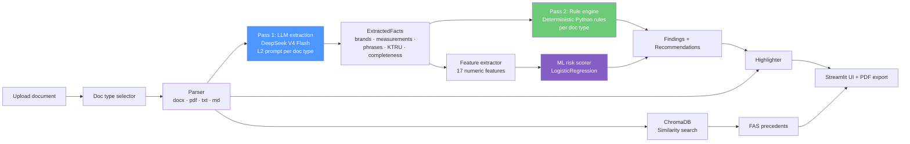

# ZakupkiCheck v2 — two-pass compliance checker for 44-ФЗ

Streamlit application that audits Russian procurement documents (technical
specifications, contract drafts, notices, full documentation bundles) against
44-ФЗ. v2 uses a **two-pass architecture**: one LLM call extracts structured
facts; a Python rule engine then decides which facts violate which articles
of 44-ФЗ. The split eliminates the overflagging that arises when independent
detectors disagree on the same evidence.

Output includes a **ML risk score** (LogisticRegression trained on the W2 eval
corpus, 781 episodes), automatic **recommendations** with legal references,
**text highlighting** of the offending fragments and **FAS precedents** from a
local ChromaDB index.

## Architecture



**Why two passes.** A single-pass design (one LLM call returning findings) ties
the model to a fixed taxonomy and yields noisy false positives when prompts
overlap (e.g. a brand-check finding gets duplicated as a restrictive-requirement
finding). Separating *what is in the document* (facts) from *what counts as a
violation* (rules) keeps the model focused, makes the rules auditable, and lets
us iterate on rules without re-prompting.

Supported document types (each has its own extraction prompt and rule set):

| Type | Articles checked | Example rules |
|---|---|---|
| `tz` (ТЗ) | ст. 33 | brand-without-equivalent, restrictive phrases, KTRU, acceptance |
| `contract` | ст. 34, 94, 96 | penalty clauses, guarantee, acceptance procedure |
| `notice` | ст. 42 | НМЦК, submission deadline, procurement method |
| `documentation` | ст. 33, 42 | superset of TZ rules + completeness |

## Layout

```
workspace/streamlit_v2/
├── app.py                          # Streamlit UI (preload + analysis)
├── pyproject.toml                  # Modern packaging (PEP 621)
├── Makefile                        # make run / test / lint / docker
├── .pre-commit-config.yaml         # ruff + mypy + standard hooks
├── health_server.py                # FastAPI /healthz sidecar
├── Dockerfile
├── components/
│   ├── schemas.py                  # Pydantic data models (DocType, ExtractedFacts, …)
│   ├── extractor.py                # Pass 1 — single LLM call per doc type
│   ├── rule_engine.py              # Pass 2 — deterministic Python rules
│   ├── aggregator.py               # Dedupe + ML score → RiskReport
│   ├── recommendations.py          # Auto-generated fixes per finding
│   ├── highlighter.py              # Mark evidence quotes in the text (word-safe)
│   ├── retrieval.py                # ChromaDB (+ TF-IDF fallback), dedup by decision_id
│   ├── report.py                   # PDF export (fpdf2)
│   ├── parser.py                   # docx/pdf/txt → plain text
│   ├── cache.py                    # SQLite cache by sha256(text)
│   ├── rate_limiter.py             # TokenBucketLimiter
│   └── logging_config.py           # structlog setup
├── models/
│   ├── lr_model.joblib             # Trained scorer
│   └── train_lr.py                 # Retrain script
├── prompts/
│   ├── system_prompt.md            # Shared system prompt
│   ├── tz_extraction.md
│   ├── contract_extraction.md
│   ├── notice_extraction.md
│   └── documentation_extraction.md
└── tests/
    ├── test_aggregator.py
    ├── test_highlighter.py
    └── test_rule_engine.py
```

## Run locally

```bash
cd workspace/streamlit_v2
pip install -e ".[dev]"

# Project root .env must contain OPENROUTER_API_KEY=sk-or-...
make run
```

UI opens at http://localhost:8501. The first start preloads the
sentence-transformers model and ChromaDB collection (~5–10 sec) so the first
analysis is fast.

## Run in Docker

```bash
make docker-build
make docker-run    # binds :8501 (UI) and :8080 (/healthz)
```

`/healthz` reports model availability — a Kubernetes readiness probe can
fail-fast if the LR weights are missing from the image.

## Retrain the risk scorer

```bash
make train-model
```

Reads `workspace/eval/ml_features.csv` (781 episodes, 17 features), runs 5-fold
cross-validation and overwrites `models/lr_model.joblib`. The script prints
CV accuracy and ROC-AUC.

## Development

```bash
make dev-install   # editable install + pre-commit hook
make lint          # ruff + mypy
make format        # ruff format + autofix
make test          # pytest
```

## What v2 does that v1 didn't

| v1 (single-call, TZ-only) | v2 (two-pass, multi-doc) |
|---|---|
| One L1 prompt mixing facts and verdicts | Pass 1 extracts *facts*; Pass 2 applies *rules* — separation of concerns |
| TZ only | Four doc types (TZ, contract, notice, documentation) with per-type prompts and rules |
| No risk score | ML risk score from LR trained on 781 episodes |
| Plain finding list | Each finding paired with an actionable fix + 44-ФЗ article |
| Text shown as plain preview | Document text with evidence quotes highlighted (word-safe, no mid-word cuts) |
| Cost / similarity / raw flag_type visible | Engineering details hidden behind a "diagnostics" toggle |
| 1–2 min first-call delay (model load) | `@st.cache_resource preload()` warms everything at startup |
| dict everywhere | Pydantic schemas end-to-end |
| Brand+equivalent overlapping with restrictive phrase → double-flagged | Rule engine drops the overlap → no overflagging |

## What was deliberately kept from v1

- The OpenRouter client, retry/backoff and JSON parser from
  `workspace/scripts/extraction_runner.py` — they are battle-tested and shared
  with the eval pipeline.
- ChromaDB-backed retrieval over `workspace/eval/fas_findings.jsonl` with the
  TF-IDF fallback for environments without sentence-transformers.
- The SQLite extraction cache (`data/cache.db`) keyed by `sha256(text)`.

## License

MIT.
