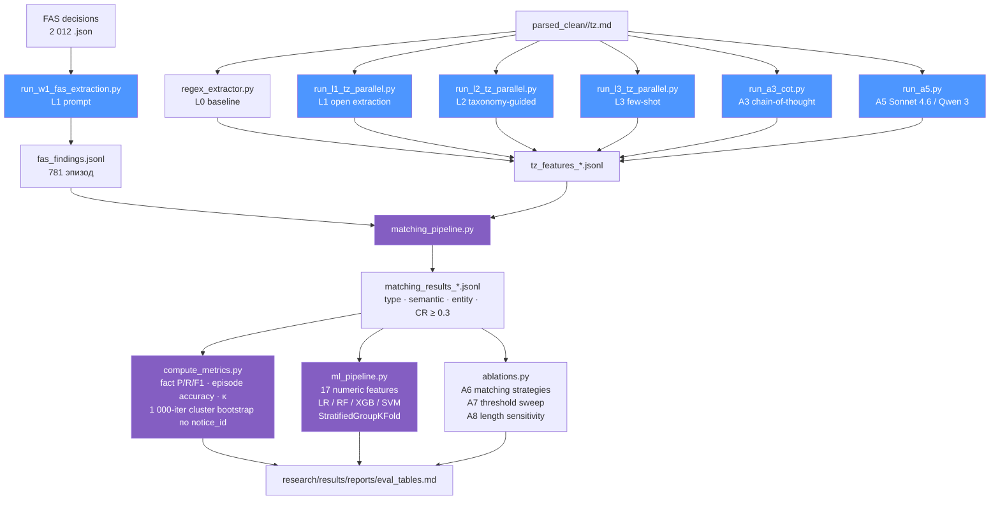
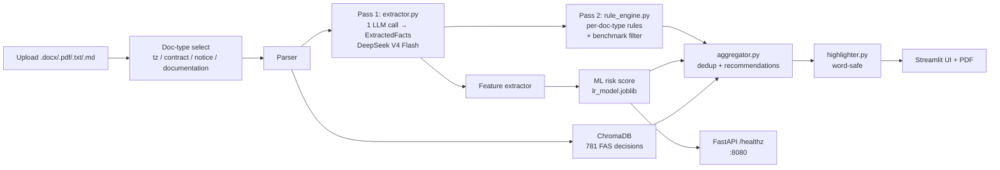

# Архитектура ZakupkiCheck

Документ описывает обе ветви проекта: исследовательский пайплайн
(`research/`) и сервисное приложение (`app/`). Терминология совпадает с
магистерской диссертацией (Маазова, 2026).

## 1. Research pipeline



### Knowledge ladder

| Уровень | Подход | Промпт |
|---|---|---|
| **L0** | Чистая регулярка, без LLM | — (`regex_extractor.py`) |
| **L1** | Open extraction по схеме без иерархии типов | `research/scripts/prompts/tz_l1_*.md` |
| **L2** | Та же схема + taxonomy hint (подсказка типа нарушения по кластеру) | `tz_l2_user_prompt_template.md` |
| **L3** | L2 + 5 few-shot примеров на тип нарушения | `tz_l3_user_prompt_template.md` + `few_shot_examples.json` |
| **A3** | L2 + Chain-of-Thought рассуждение перед JSON-ответом | `tz_a3_cot_user_prompt_template.md` |
| **A5** | L2-промпт, но другой провайдер: Claude Sonnet 4.6 / Qwen 3 (1M context) | те же промпты |

### Containment Ratio (CR)

Пара (q_FAS, q_TZ) считается сопоставленной, если совпали типы (или совпали
fuzzy-синонимично, см. ниже) **и** CR ≥ 0.3, где

```
CR = |tokens(q_FAS) ∩ tokens(q_TZ)| / |tokens(q_FAS)|
```

Константа `CR_THRESHOLD = 0.3` и функция `containment_ratio()` определены в
`research/scripts/matching_pipeline.py`. По умолчанию CR-фильтрация
отключена (`cr_threshold=None`) — это сохраняет результаты W1–W2. Для
запусков, требующих гейтинг по CR (ablation, ВКР §3.2.3), вызывайте
`match_episode(..., cr_threshold=CR_THRESHOLD)`.

### Словарь синонимов типов

Для fuzzy type matching используется `TYPE_SYNONYMS` (`matching_pipeline.py`):

```python
TYPE_SYNONYMS = {
    "brand_without_equivalent": {brand_without_equivalent, restrictive_requirement},
    "restrictive_requirement":  {restrictive_requirement, brand_without_equivalent, incomplete_description},
    "incomplete_description":   {incomplete_description, restrictive_requirement, ktru_mismatch},
    ...
}
```

Функция `types_match_fuzzy(fas_type, tz_type)` возвращает `True`, если типы
равны, либо если `tz_type` входит в синонимный набор `fas_type`. Активируется
параметром `match_episode(..., fuzzy_types=True)`.

### Кластерный бутстрэп

`compute_metrics.py` пересчитывает доверительные интервалы 95 % для всех
метрик через **1 000 итераций ресемплинга `notice_id` с возвращением**
(`BOOTSTRAP_ITERS = 1000`, функция `cluster_bootstrap()`). Группировка по
`notice_id` нужна, потому что один notice может породить несколько эпизодов
(аргументов жалобы) — иначе CI'ы окажутся заниженными.

### ML-пайплайн

`ml_pipeline.py` строит матрицу 17 фичей (`data/eval/ml_features.csv`)
из L1-извлечения, обучает четыре классификатора:

- LogisticRegression (StandardScaler + L2)
- RandomForestClassifier
- XGBClassifier
- SVC (RBF)

Кросс-валидация — `StratifiedGroupKFold(n_splits=5, groups=notice_id)`,
гиперпараметры — `GridSearchCV` на маленькой сетке. Победитель сериализуется
в `lr_model.joblib` (≈ 2 КБ). Сервис подгружает его как ML-скорер риска.

## 2. Сервисное приложение (`app/`)



### Двухпроходная архитектура

Pass 1 — один LLM-вызов с doc-type-специфичным промптом — возвращает
**`ExtractedFacts`** (Pydantic v2):

```python
ExtractedFacts:
    brands: list[BrandMention]              # name, has_equivalent_clause, quote
    measurements: MeasurementFacts          # has_units, has_ranges, missing_chars
    restrictive_phrases: list[RestrictivePhrase]
    standards: StandardsFacts               # GOST, KTRU code, beyond_ktru
    completeness: CompletenessFacts         # functional/technical/quality/...
    contract_specific: ContractSpecificFacts
    notice_specific: NoticeSpecificFacts
```

Pass 2 — `rule_engine.evaluate(facts, doc_type)` — применяет
детерминированные правила:

| DocType | Правила |
|---|---|
| `tz` | brand_without_equivalent, restrictive_phrases, missing_acceptance, incomplete_description, ktru_mismatch |
| `contract` | brand_without_equivalent, restrictive_phrases, no_penalty_clause, no_guarantee, no_acceptance_procedure |
| `notice` | no_nmck, no_submission_deadline, no_procurement_method, restrictive_phrases |
| `documentation` | brand_without_equivalent, restrictive_phrases, missing_acceptance, incomplete_description |

### Benchmark filter

Если evidence_quote содержит маркеры эталона производительности
(«не хуже», «не ниже», «не менее», «не слабее», «уровня», «класса»,
«категории») — правило `rule_brand_without_equivalent` молча пропускает
бренд: это benchmark, а не закрытая марка (ВКР §4.6.1).

### Anti-double-flag

Если фраза в `restrictive_phrases` совпадает с брендом, у которого
`has_equivalent_clause=True`, правило `rule_restrictive_phrases` пропускает
её — иначе один и тот же бренд флагуется дважды (ВКР §4.6, проблема
v2-baseline).

### Кэш и preload

- SQLite-кэш по `sha256(text)` (`components/cache.py`).
- `@st.cache_resource preload()` прогревает sentence-transformers и
  ChromaDB-индекс при старте → первый анализ не платит 1–2 мин загрузки модели.
- `TokenBucketLimiter(max_requests=20, window_sec=60)` ограничивает суммарную
  частоту LLM-вызовов на процесс.
